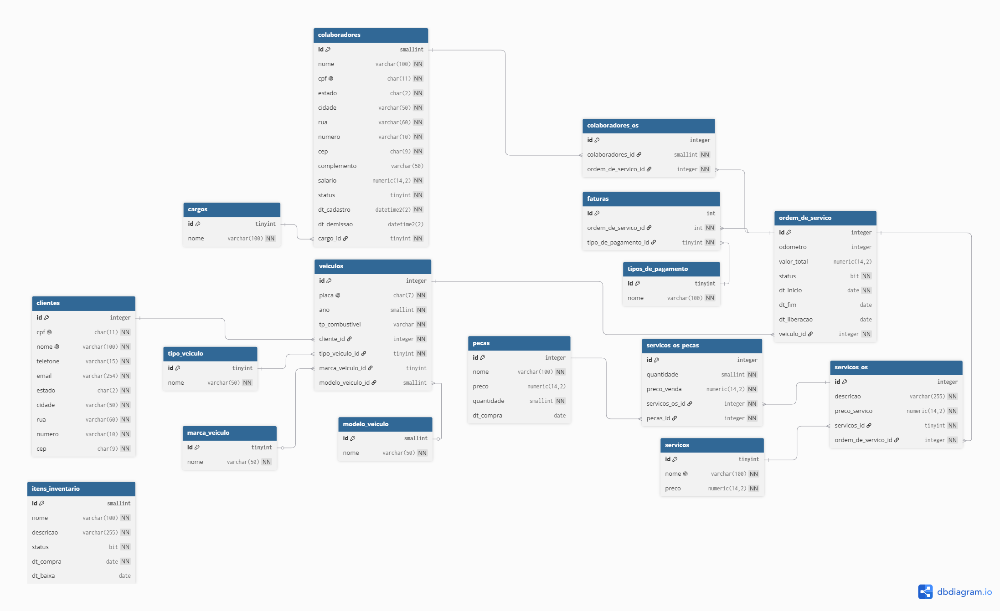

## Projeto Sistema de Manutenção de Veículos

Este projeto consiste na criação de um modelo físico de um banco de dados para um sistema de gerenciamento de oficina mecânica.
O sistema permite o controle de clientes, veículos, ordens de serviço, colaboradores, peças e fornecedores, utilizando todos os conceitos e dinâmicas práticas de SQL desenvolvidas em aula.

### Integrantes
Nathan Rocha Gomes - [NathanRochaGomes](https://github.com/NathanRochaGomes) 
Jonas Fortunato Rosset - [JonasFortunatoRosset](https://github.com/JonasFortunatoRosset) 
Emanuel Reus - [Emanuel Reus](https://github.com/EmanuelReus6) 
Gabriel Vaz Lima - [Gabriel-Vazz](https://github.com/gabriel-vazz) 

### Modelo Físico
Utilizamos a ferramenta de modelagem de dados [dbdiagram.io](https://dbdiagram.io/) para criação do modelo físico do banco de dados, para posterior exportação dos scripts DDL das tabelas e relacionamentos.

### Dicionário de Dados
As informações sobre as tabelas e índices foram documentadas na planilha [DDL_Sistema_Manutencao_Veiculos.xlsx](dicionario-dados/DDL_Sistema_Manutencao_Veiculos_v3.xlsx).

### Scripts SQL
Para este projeto foi utilizado o banco de dados [SQL Server](https://www.microsoft.com/pt-br/sql-server).

Abaixo, segue os scripts SQL separados por tipo:
+ [Tabelas](scripts/ddl/tabelas)
+ [Funções](scripts/ddl/functions)
+ [Gatilhos](scripts/ddl/triggers)
+ [Procedimentos Armazenados](scripts/ddl/stored_procedures)

### Código Fonte

> 🚧 Em desenvolvimento

### Passos para execução

> 🚧 Em desenvolvimento

### Relatório Final

> 🚧 Em desenvolvimento

### Referências Bibliográficas

> 🚧 Em desenvolvimento
